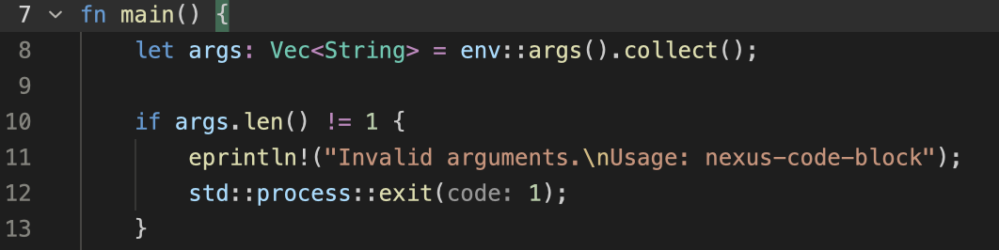
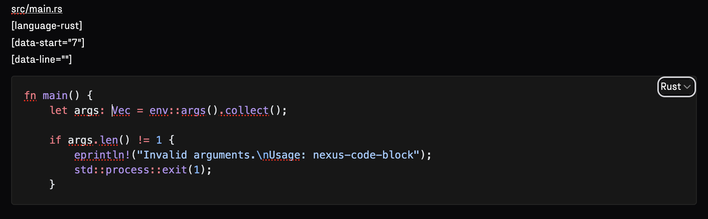

# Nexus Code Block Task for Zed Editor
This repo provides a task for the Zed Editor that copies selected code into MacOs's clipboard and adds relevant metadata such as file name and line number of the first line of the selected block. This task is intended to be used when writing audit reports in Nexus.

## Installation

1. Install the Rust utility program
```console
git clone git@github.com:Ikrk/nexus-code-block.git
cd nexus-code-block
cargo build
cargo install --path .
```

2. Add the task to Zed
- To add globally: add the content of the [tasks.json](tasks.json) file to ~/.config/zed/tasks.json.
- To add to a project only: create a .zed folder in the root of your project and copy the [tasks.json](tasks.json) file there.

For more information about Zed tasks, [check the documentation](https://zed.dev/docs/tasks).

## Usage
Once installed:
1. Select some code in your Zed editor.
2. Open the command palette: cmd+shift+p.
3. Type "task: spawn" and hit enter.
4. Select "Nexus code block" and hit enter.
5. Go to Nexus and paste your code to the report.


## Supported OS and languages
Currently only MacOS is supported.

Automatic language detection for the following file extensions:
- Markup:  html, htm, xml, xhtml, svg, mathml, ssml, atom, rss
- CSS:  css
- C-like:  c, h, cpp, hpp, cc, cxx, cs, java, m, mm
- JavaScript:  js, mjs, cjs
- Rust:  rs
- Go:  go
- Solidity:  sol
- Haskell:  hs, lhs

Defaults to c-like language in case of unknown file extension.


## Example
The following Rust code:


is copied and pasted to Nexus as:

